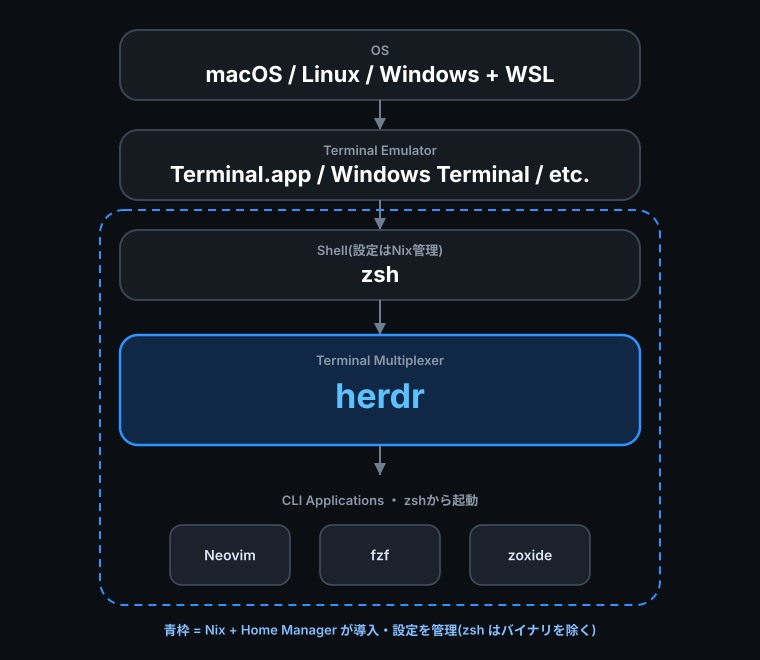
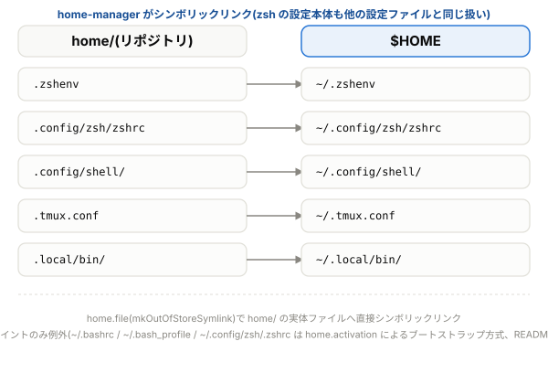

# dotfiles

[](https://github.com/S6U5/dotfiles/actions/workflows/lint.yml)
[](https://github.com/S6U5/dotfiles/actions/workflows/test.yml)
[](https://github.com/S6U5/dotfiles/actions/workflows/secrets-scan.yml)
[](LICENSE)
[](#前提)

WSL / macOS / Linux で同じシェル環境・ツール・キーバインドを再現するための個人用 dotfiles です。**Nix + home-manager** でパッケージ導入と設定配布を単一の経路に一本化しています。

> **注**: あくまで個人の設定(好みが濃いめ)です。そのまま使うより、構成や
> スクリプトの作りを参考にしたり、フォークして自分用に育てるのに向いています。





## 目次

- [特徴](#特徴)
- [前提](#前提)
- [クイックスタート](#クイックスタート)
- [セットアップの詳細](#セットアップの詳細)
- [収録コマンド・関数](#収録コマンド関数)
- [同梱プラグイン](#同梱プラグイン)
- [おすすめエージェントスキル](#おすすめエージェントスキル)
- [リポジトリ構成](#リポジトリ構成)
- [更新](#更新)
- [テスト](#テスト)
- [push を無効化する(誤 push 防止)](#push-を無効化する誤-push-防止)
- [ライセンス](#ライセンス)

## 特徴

- **クロスプラットフォーム** — zsh / bash 両対応。macOS・WSL・Linux(Raspberry Pi 含む)で同じコマンド・設定が動きます
- **Nix + home-manager に一本化** — パッケージ導入・dotfiles 配布(`home/` 以下のシンボリックリンク)を単一の経路にまとめています。`nixpkgs-unstable` を追跡するため WSL / Linux でも apt のように古いバージョンで止まりません(判断根拠は [`docs/decisions/dotfiles-distribution.md`](docs/decisions/dotfiles-distribution.md) / [`docs/decisions/package-management.md`](docs/decisions/package-management.md) 参照)
- **home/ を直接編集すればすぐ反映される** — `home.file` は `mkOutOfStoreSymlink` で配布しているため、Nix store へコピーする通常の方式と違い、`home/` 配下のファイルを編集すればそのまま `$HOME` 側に反映されます(`home-manager switch` の再実行は不要)
- **機密ゼロ方針** — API キー・個人情報はリポジトリに置かず、git 管理外のローカルファイル(`*.local` / `local.sh`)へ分離。pre-commit フック + CI の二段でコミット前後に機密混入を検査します
- **テスト済み** — home-manager 経由の配布(リンク先・実行可能属性・bash / zsh ブートストラップ等)を自動テストで検証し、CI で Ubuntu / macOS 両方に対して毎回実行しています

## 前提

> [!IMPORTANT]
> **Nix 本体のインストールが必須です**。パッケージ一式(tmux / fzf / shellcheck / shfmt / zoxide / neovim / ripgrep / fd / eza / starship / wezterm 等)も `home/` 配下の設定ファイル配布も、すべて Nix + home-manager 経由で行うため、**Nix が使えない環境ではこの dotfiles は機能しません**(意図的にフォールバックは作っていません)。

対応システムと、`home-manager switch` に渡す flake ターゲット(後述の `<system>`):

| システム | `<system>` | 備考 |
|---|---|---|
| WSL / Linux(Intel・AMD) | `x86_64-linux` | 動作確認: WSL(Ubuntu)・Debian 系 |
| WSL / Linux(ARM) | `aarch64-linux` | 例: Raspberry Pi OS |
| macOS(Apple Silicon) | `aarch64-darwin` | |

## クイックスタート

**1. クローン**

```sh
git clone https://github.com/S6U5/dotfiles.git
cd dotfiles
```

**2. Nix をインストール**(未導入の場合)

[NixOS/nix-installer](https://github.com/NixOS/nix-installer) を使います(NixOS 公式が管理する Determinate Nix Installer のフォーク。flakes が扱え、`nix-installer uninstall` で綺麗に戻せる点から公式のクラシックインストーラより推奨)。

```sh
curl -sSfL https://artifacts.nixos.org/nix-installer | sh -s -- install --enable-flakes
```

インストール後、**シェルを再起動**(または新しいターミナルを開く)してください。WSL では Windows 側ではなく WSL の Linux シェル内で実行します(Nix 自体も WSL 内に入ります)。

**3. 配布を適用**

リポジトリのルートで `DOTFILES_DIR` を設定し(`nix/home.nix` が `home/` の実体パスを解決するために必要)、初回だけ `nix run` 経由で `home-manager` を呼びます(初回は `home-manager` コマンドがまだ PATH に無いため)。`<system>` は[対応システム表](#前提)の値に置き換えてください。

```sh
export DOTFILES_DIR=$(pwd)
nix run home-manager -- switch --flake ./nix#<system> --impure
```

初回の `switch` が完了すると home-manager 自体も導入され、以降は短い形で実行できます(`DOTFILES_DIR` はシェルセッションごとに設定してください):

```sh
home-manager switch --flake ./nix#<system> --impure
```

**4. ターミナルのフォントを設定**

Nerd Font 本体は `home-manager switch` で入りますが、**ターミナル側でそのフォントを選ぶ設定が
別途必要**です。これをしないと Starship のプロンプトや Neovim のアイコンが豆腐(□)になります。

WSL では Windows 側にもインストールが要ります(Windows Terminal は WSL 内のフォントを参照
できないため)。

```sh
wsl-font-setup    # WSL のみ。Windows 側へユーザーフォントとして入れる(管理者権限不要)
```

ターミナルごとの選択方法は[セットアップの詳細](#セットアップの詳細)の「Nerd Font をターミナルで
有効にする」を参照してください。

**5. zsh をログインシェルにする**

この dotfiles の中心(Starship・補完・履歴設定・自作関数)は zsh 側にあるため、ここまでやって
完成です。macOS は標準で zsh なので何もする必要はありません。

WSL / Linux は zsh 本体の導入から必要です(Ubuntu / Debian 系の例。パッケージ名はディストリで
異なります)。

```sh
sudo apt install zsh
chsh -s "$(which zsh)"
```

反映にはログアウト → 再ログイン(WSL ならターミナルの再起動でも可)が要ります。zsh バイナリ
自体を Nix 管理下に置いていない理由は
[`docs/decisions/login-shell.md`](docs/decisions/login-shell.md) にあります。

**6. エージェント用プラグインを入れる**(Claude Code / Codex を使う場合)

同梱プラグインは home-manager では配られません(Marketplace 経由で各ツールに登録します)。
まとめて導入するコマンドがあります。

```sh
agent-plugins-setup
```

何が入るかは[同梱プラグイン](#同梱プラグイン)を参照してください。使わない場合は不要です。
有効/無効の切り替えはこのコマンドでは触らないので、必要なものを各ツール側で適宜有効化して
ください(Claude Code は `/plugin`、Codex は `config.toml` の `enabled`)。

**7. 公式のエージェントスキルを検討する**(任意)

手順6で入るのはこのリポジトリの自作プラグインです。これとは別に、各ツールが公式に配布して
いるスキルもあります。使いたい場合は[おすすめエージェントスキル](#おすすめエージェントスキル)
から各公式ドキュメントへ辿ってください(非公式スキルは自作を除き採用しない方針です)。

---

これで完了です。プラットフォーム固有の追加設定(Nerd Font・WezTerm・zsh ログインシェル等)や補足は次章にまとめています。

## セットアップの詳細

初回は上記の最小手順で動きます。以下はプラットフォーム別・用途別の補足なので、**必要なものだけ開いてください**。

<details>
<summary><b><code>--impure</code> が必要な理由</b></summary>

実際のユーザー名やリポジトリパスをコミットにハードコードしないため、`nix/home.nix` は `builtins.getEnv` で実行時に解決しています。flake の pure 評価では環境変数を読めないため、`--impure` が必要です。

</details>

<details>
<summary><b>flake.lock の更新</b></summary>

`nix/flake.lock` はバージョンを固定するためリポジトリにコミット済みなので、通常は生成不要です。`nixpkgs` / `home-manager` のバージョンを更新したいときだけ、次を実行してください:

```sh
nix flake update ./nix
```

</details>

<details>
<summary><b>zsh バイナリを管理対象外にしている理由</b></summary>

zsh バイナリ(shell 実行ファイル)自体はここには含めていません。ログインシェルを Nix 管理下に置くとロックアウトのリスクがあるため、意図的に対象外にしています(判断根拠は [`docs/decisions/login-shell.md`](docs/decisions/login-shell.md) 参照)。zsh の**設定内容**(`.zshenv` と設定本体 `.config/zsh/zshrc`)は他の `home/` 配下のファイルと同じく home-manager の `home.file` で配布します(エントリポイント `~/.config/zsh/.zshrc` のみ `~/.bashrc` と同様に `home.activation` が生成、下記「リポジトリ構成」参照)。

</details>

<details>
<summary><b>世代・パッケージのガベージコレクション</b></summary>

古い世代やパッケージのガベージコレクションは home-manager / Nix 本体任せです。日常のビルドでは直近の世代が GC root として保護されるため、ディスクを空けたくなったときに手動で実行してください:

```sh
home-manager expire-generations   # 古い世代を削除
nix-collect-garbage -d            # 到達不能な store パスを回収
```

</details>

<details>
<summary><b>Nerd Font をターミナルで有効にする(Starship・Neovim のアイコン表示に必要)</b></summary>

Starship のプロンプト(セパレーター記号や言語アイコン)や Neovim(LazyVim)のファイルツリーアイコンは Nerd Font 専用のグリフを使います。`nerd-fonts.jetbrains-mono` は `home-manager switch` で自動導入されますが、**フォントファイルを置くだけでは表示されません**。ターミナルエミュレータ側で明示的にそのフォントを選ぶ設定が別途必要です。

- **WSL の場合は特に注意**: `home-manager switch` は WSL 内(Linux 側)にフォントを入れるだけで、Windows Terminal は Windows ネイティブのアプリのため WSL 内のフォントを参照できません。**Windows 側にも別途 Nerd Font をインストール**する必要があります。WSL 内で `wsl-font-setup` を実行すると、WSL 側に導入済みの JetBrainsMono Nerd Font を Windows 側へユーザーフォントとして自動インストールできます(管理者権限不要)。手動でやる場合は [Nerd Fonts 公式サイト](https://www.nerdfonts.com/) から `JetBrainsMono Nerd Font` をダウンロードし、Windows 側でインストールしてください。
- **Windows Terminal**: 設定 → プロファイル(既定または対象プロファイル) → 外観 → フォントフェイス を `JetBrainsMono Nerd Font` に変更します。
- **VS Code の統合ターミナル**(Windows / macOS 共通): `settings.json` の `terminal.integrated.fontFamily` を `"JetBrainsMono Nerd Font"` に設定します。
- **macOS のターミナル(Terminal.app / iTerm2 等)**: 環境設定のフォントを `JetBrainsMono Nerd Font` に変更します。

設定後もアイコンが崩れる場合は、フォントが正しく選択されているか(ターミナルの再起動が必要な場合があります)を確認してください。

</details>

<details>
<summary><b>Neovim(LazyVim)の初回セットアップ</b></summary>

初回に `nvim` を開くと LazyVim がプラグインを自動インストールします。その際、コミット済みの `lazy-lock.json` と異なるバージョンが入ると、シンボリックリンク越しにリポジトリの作業ツリーが書き換わり `git status` が汚れます。**初回起動後に `:Lazy restore` を実行**して、ロックファイルに記録されたバージョンへ揃えてください(以後、差分は出なくなります)。

プラグインを意図的に更新するときは `:Lazy update` を実行し、変化した `lazy-lock.json` を**そのままコミット**してください(ロックファイルの差分は「プラグイン更新の記録」であり、コミットするのが lazy.nvim の想定運用です)。

</details>

<details>
<summary><b>WezTerm を使う</b></summary>

ターミナルエミュレータは [WezTerm](https://wezterm.org/) を採用しています(判断根拠は [`docs/decisions/terminal-emulator.md`](docs/decisions/terminal-emulator.md) 参照)。設定ファイルは `home/.config/wezterm/wezterm.lua`。

- **macOS / Linux**: `home-manager switch` で WezTerm 本体・設定とも自動導入されます。
- **WSL**: 実際に画面を描画する WezTerm は Windows ネイティブ側で動きます。`home-manager switch` は WSL 内(Linux 側)にしか配布できないため、Windows 側で以下を手動対応してください。
  1. WezTerm 本体を Windows 側にインストールします(例):

     ```powershell
     winget install wez.wezterm
     ```
  2. 設定ファイルは WSL 側の `~/.config/wezterm/wezterm.lua` をそのまま使えます。Windows の環境変数 `WEZTERM_CONFIG_FILE` に WSL 側パスへの UNC パス(例: `\\wsl.localhost\<ディストリ名>\home\<ユーザー名>\.config\wezterm\wezterm.lua`)を設定してください。WSL 内で `wsl-wezterm-setup` を実行すると自動設定できます(`setx.exe` でユーザー環境変数として永続化。反映には WezTerm の再起動が必要)。
  3. `wezterm.lua` 側で WSL ドメインを自動検出し `default_domain` に設定するため、起動すると WSL 内のシェルに接続されます。起動するシェルは zsh を明示指定しているため、WSL ディストリ側に zsh のインストールが必要です(未インストールだとペインの起動に失敗します。インストール手順は「zsh をログインシェルにする場合」参照。`chsh` でのログインシェル変更までは必須ではありません)。

**壁紙**はデフォルトで有効です(プロンプトの配色に合わせた AI 生成のテンプレート壁紙 `home/.config/wezterm/wallpaper.png` を同梱。設定ディレクトリ相対で解決するため WSL でもパス変換なしで表示されます)。差し替える場合は `~/.config/wezterm/wallpaper.local.lua`(git 管理外、`*.local` は `.gitignore` 対象)を作成し、画像への絶対パスを1行で `return` してください(例: `return '/path/to/wallpaper.png'`。WSL では画像を読むのは Windows 側の WezTerm なので、`\\wsl.localhost\...` 形式の UNC パスか Windows パスを指定します)。壁紙を無効にする場合は `return false` と書きます。個人の画像はコミットせず local 側で差し替える方針です(置き場所は自由。リポジトリ配下に置きたい場合は git 管理外の `local/` ディレクトリへ)。

</details>

<details>
<summary><b>zsh をログインシェルにする場合(任意)</b></summary>

- macOS: 標準で zsh が入っているため何もする必要はありません。
- WSL / Linux: Windows 自体には zsh が入っていないため、WSL の Linux ディストリビューション側で別途インストールが必要です。パッケージ名・コマンドはディストリごとに異なるため配布元の公式ドキュメント(zsh 公式の [Installing zsh(FAQ)](https://zsh.sourceforge.io/FAQ/zshfaq01.html) も参考)を参照してください。Ubuntu/Debian 系の例:

  ```sh
  sudo apt install zsh      # zsh 本体を導入(パッケージ名はディストリで異なる)
  chsh -s $(which zsh)      # ログインシェルに設定
  ```

  反映にはログアウト→再ログイン(WSL の場合はターミナルの再起動でも可)が必要です(`man chsh` も参照)。

</details>

<details>
<summary><b>既存の設定ファイルとぶつかったとき</b></summary>

`~/.bashrc`(Ubuntu / WSL では OS が最初から設置)や `~/.tmux.conf` など、既存ファイルがある状態で `home-manager switch` を実行すると、home-manager は衝突を検知して**エラーで停止**します(黙って上書きしません)。対処法:

1. 中身が不要、またはこのリポジトリに取り込み済み → 既存ファイルを `<ファイル名>.bak` に退避してから上書き:

   ```sh
   home-manager switch --flake ./nix#<system> --impure -b bak
   ```
2. マシン固有の値(名前・メール・キー等)が入っている → ローカル側ファイル(`~/.config/shell/local.sh` / `~/.tmux.conf.local`)へ移してから `-b bak` を付けて再実行
3. 判断に迷う → 事前に手動で退避してから進めてください:

   ```sh
   cp -a ~/.対象ファイル ~/.対象ファイル.manual-backup
   ```

(`~/.gitconfig` は home-manager 配布の対象外です。`templates/git/README.md` の手順で手動セットアップしてください。)

</details>

<details>
<summary><b>リポジトリを別の場所へ移動したとき</b></summary>

`DOTFILES_DIR` を設定し直してから `home-manager switch` を再実行してください:

```sh
export DOTFILES_DIR=$(pwd)
home-manager switch --flake ./nix#<system> --impure
```

</details>

<details>
<summary><b>ネイティブ Windows 側の npm / pnpm / uv にもサプライチェーン対策を効かせる(手動コピー)</b></summary>

home-manager の配布が届くのは WSL 内の `$HOME` までで、Windows に直接インストールした npm / pnpm / uv には効きません(この dotfiles は Nix 前提のため、ネイティブ Windows 向けの自動配布は意図的に作っていません。判断根拠は [`docs/decisions/windows-supply-chain.md`](docs/decisions/windows-supply-chain.md))。

対策設定のファイルはいずれも機密ゼロ・各ツール標準の形式なので、そのまま Windows 側の標準パスへコピーすれば同じ対策が効きます。WSL からは1コマンドで一括コピーできます:

```sh
wsl-supplychain-setup
```

Windows 側に別内容の既存ファイル(認証トークン入りの `.npmrc` 等)があった場合は、初回のみ同名の `.bak` に退避してから上書きします(必要な値は手で書き戻してください)。手動でコピーする場合の対応表:

| リポジトリ内のファイル | Windows 側のコピー先 |
|---|---|
| `home/.npmrc` | `%USERPROFILE%\.npmrc` |
| `home/.config/pnpm/rc` | `%LOCALAPPDATA%\pnpm\config\rc` |
| `home/.config/uv/uv.toml` | `%APPDATA%\uv\uv.toml` |

- コピーは明示実行のみで、自動では追従しません。リポジトリ側の設定を変えたら再実行(再コピー)してください。
- バージョン要件: npm の `min-release-age` は npm 11.5.1+、uv の `exclude-newer` の相対期間指定は uv 0.9.17+ が必要です(それ未満では効かないか、設定の解釈でエラーになります)。

</details>

## 収録コマンド・関数

インストール後、新しいシェルから使えます。候補が複数あるものは fzf(あれば)か番号選択になり、引数で名前の絞り込みができます。

### 移動(cd 系)

| コマンド | 移動先 |
|---|---|
| `cdov [名前]` | Obsidian の vault(一覧は Obsidian 自身の設定から自動取得) |
| `cdic [名前]` | iCloud Drive |
| `cdgd [名前]` | Google Drive(マイドライブ / 共有ドライブ) |
| `cdod` / `cdode [名前]` | OneDrive(個人用 / 組織用) |
| `cdwin [サブフォルダ]` | Windows のユーザーフォルダ(WSL 用。Downloads 等は場所を移動していても正しく解決) |
| `cdgr` | git リポジトリのルート |
| `mkcd <dir>` | ディレクトリを作って移動 |
| `tmpd` | 使い捨ての一時ディレクトリ(掃除は OS 任せ) |

### アプリ起動

| コマンド | 動作 |
|---|---|
| `word` / `excel` / `powerpoint` / `outlook` / `onenote` `[ファイル]` | Office で開く(WSL では Windows 側の Office を起動。対応形式のみタブ補完・1ファイルまで) |
| `teams` | Microsoft Teams を起動 |
| `fusion360 [ファイル]` | Autodesk Fusion(旧 Fusion 360)で開く |
| `arduino [ファイル]` | Arduino IDE で開く(Linux に本物の arduino コマンドがあればそちらを優先) |
| `ov [名前]` | Obsidian を vault 指定で起動 |
| `explorer [パス]` | ファイルマネージャで開く(WSL: エクスプローラー / macOS: Finder / Linux: xdg-open) |

### ユーティリティ

| コマンド | 動作 |
|---|---|
| `dotfiles-update` | どこからでもこのリポジトリを更新(`git pull`。更新があれば `home-manager switch` の実行を促すメッセージを表示。実行はしない) |
| `notify <タイトル> [本文]` | デスクトップ通知(macOS / WSL / Linux 対応) |
| `cachesweep [--clean] [--docker]` | 開発ツールのキャッシュをサイズ表示・削除 |
| `wsl-compact [--sparse]` | WSL の仮想ディスクを圧縮して空き領域を Windows に返す |
| `wsl-wezterm-setup` | Windows 側の環境変数 `WEZTERM_CONFIG_FILE` を WSL 側の `wezterm.lua` に向けて設定 |
| `wsl-font-setup` | WSL 内の JetBrainsMono Nerd Font を Windows 側にユーザーフォントとしてインストール |
| `wsl-supplychain-setup` | サプライチェーン対策設定(npm / pnpm / uv)を Windows 側の標準パスへコピー(WSL 用。詳細は[セットアップの詳細](#セットアップの詳細)参照) |
| `agent-plugins-setup [プラグイン名...]` | 同梱プラグインを Claude Code / Codex へ登録・導入し、取り残しを点検(明示実行。詳細は[同梱プラグイン](#同梱プラグイン)参照) |
| `wincred <get\|set\|delete\|list> [名前]` | Windows 資格情報マネージャーの汎用資格情報を読み書き(WSL 用)。API キー等を平文ファイルに置かずに済む(判断根拠は [`docs/decisions/secrets-storage.md`](docs/decisions/secrets-storage.md)) |
| `fbr` | fzf で git ブランチを選んで切替(fzf のある環境のみ) |

このほか、fzf があれば Ctrl-R(履歴検索)/ Ctrl-T(ファイル)/ Alt-C(ディレクトリ移動)、zoxide があれば `z` での高速ジャンプが有効になります。`ls` / `ll` / `la` / `lt`(ツリー表示)は eza があればアイコン・色付き表示になります(無い環境では色付き ls にフォールバック。判断根拠は [`docs/decisions/ls-replacement.md`](docs/decisions/ls-replacement.md) 参照)。

## 同梱プラグイン

このリポジトリ自身が Claude Code / Codex の**ローカル Marketplace** になっていて、自作スキルを
プラグインとして配ります。スキル本体(`SKILL.md`)は1つだけ持ち、Claude Code・Codex・Agent
Plugins 標準に準拠したクライアント(Cursor / GitHub Copilot / VS Code など)のいずれからも同じ
ものが読まれます。

| プラグイン | 収録スキル | 内容 |
|---|---|---|
| [`agent-interop`](plugins/agent-interop/README.md) | `agents-init` | CLAUDE.md を `@AGENTS.md` の1行にとどめ、指示の実体を AGENTS.md へ集約する |
| | `agent-plugin-init` | Claude Code / Codex / 標準の3形式に届くプラグインを作る |
| [`shin5`](plugins/shin5/README.md) | `shin5` | 図を主体に、とても簡単な日本語で解説する |

Marketplace を登録してから、プラグインごとに導入します(マシンごとに初回のみ)。

```sh
# Claude Code
claude plugin marketplace add S6U5/dotfiles --sparse .claude-plugin plugins
claude plugin install agent-interop@s6u5-dotfiles

# Codex
codex plugin marketplace add S6U5/dotfiles --sparse .agents --sparse plugins
codex plugin add agent-interop@s6u5-dotfiles
```

Cursor は目録を経由せず `~/.cursor/plugins/local/` を直接読むため、シンボリックリンクを張ります。

```sh
ln -s "$PWD/plugins/agent-interop" ~/.cursor/plugins/local/agent-interop
```

複数マシンで使う場合や、`git pull` のあとに反映したい場合は、まとめて面倒を見るコマンドがあります。

```sh
agent-plugins-setup             # 登録・更新・未導入分の導入・取り残しの点検
agent-plugins-setup shin5       # 指定したプラグインだけ
```

**ローカル参照の Marketplace は自動更新が効かない**ため、リポジトリを更新したらこれを実行します。
何度実行しても安全で、導入済みのものや有効/無効の状態には触れません。

<details>
<summary><b>ネイティブ Windows 側の Claude Code / Codex にも同じプラグインを届ける</b></summary>

WSL とネイティブ Windows の両方にエージェントを入れている場合、設定ディレクトリは別物(WSL 内は `~/.claude` / `~/.codex`、Windows 側は `%USERPROFILE%\.claude` / `%USERPROFILE%\.codex`)なので、**WSL 内で行った Marketplace の登録は Windows 側には届きません**。プラグインで効くのはファイルの実体ではなく参照先なので、コピーはせず、Windows 側でも同じ GitHub リポジトリを登録します(UNC パス `\\wsl.localhost\...` でのローカル登録は採りません。判断根拠は [`docs/decisions/windows-agent-plugins.md`](docs/decisions/windows-agent-plugins.md))。

Windows の PowerShell で、マシンごとに初回のみ:

```powershell
claude plugin marketplace add S6U5/dotfiles --sparse .claude-plugin plugins
claude plugin install agent-interop@s6u5-dotfiles
claude plugin install shin5@s6u5-dotfiles

codex plugin marketplace add S6U5/dotfiles --sparse .agents --sparse plugins
codex plugin add agent-interop@s6u5-dotfiles
codex plugin add shin5@s6u5-dotfiles
```

更新も Windows 側で実行します。

```powershell
claude plugin marketplace update s6u5-dotfiles
codex plugin marketplace upgrade s6u5-dotfiles
```

- **Windows 側は GitHub 参照のため、push するまで変更が反映されません**(WSL 側の `agent-plugins-setup` はローカル参照なので即時)。プラグインを編集した直後に Windows 側へ反映したいときは、push してから上の更新コマンドを実行してください。
- `agent-plugins-setup` は POSIX sh で書かれているため、ネイティブ Windows では動きません。Windows 側は上記を手で実行します。

</details>

更新・無効化・撤去や、プラグインを自作するときの手順は
[`plugins/README.md`](plugins/README.md) を参照してください。

## おすすめエージェントスキル

Claude Code などのコーディングエージェントと組み合わせて使うのがおすすめな、各ツール**公式**の agent skill の一覧です(非公式スキルは自作を除き採用しません。判断根拠は [`docs/decisions/agent-skills.md`](docs/decisions/agent-skills.md) 参照)。herdr のスキルだけは nixpkgs のパッケージがスキル本文を同梱しているため、`home-manager switch` で `~/.claude/skills/herdr` に自動配布されます(手動インストール不要。バイナリとスキルのバージョンが常に一致)。それ以外はインストール手順・配布形態が変わりうるためここには転記せず、各公式ドキュメントを参照してください。

| スキル | できること | 導入 |
|---|---|---|
| herdr | この dotfiles 採用のターミナルマルチプレクサ(判断根拠は [`docs/decisions/terminal-multiplexer.md`](docs/decisions/terminal-multiplexer.md))。ペイン分割・セッション操作をエージェントが `herdr` CLI 経由で行えるようになる | `home-manager switch` で自動配布([herdr.dev/docs/agent-skill](https://herdr.dev/docs/agent-skill/)) |
| Playwright CLI | ブラウザ操作・E2E テストをエージェントがコンテキスト効率よく行うための公式 CLI + skill | [playwright.dev/docs/getting-started-cli](https://playwright.dev/docs/getting-started-cli) |
| Obsidian | ノートの読み書き・全文検索・タスクやタグの照会などをエージェントが公式 CLI 経由で行えるようになる公式スキル集(この dotfiles にも Obsidian 連携コマンド `cdov` / `ov` あり) | [github.com/kepano/obsidian-skills](https://github.com/kepano/obsidian-skills) |

推奨をやめたスキルは表から黙って消さず、日付・理由付きで以下に移して残します。

- **廃止した推奨**: 現時点では無し

## リポジトリ構成

```
home/              $HOME に同じ構造でリンクされる設定ファイル群
├── .zshenv                            zsh のエントリ(ZDOTDIR を .config/zsh に切り替えるだけ)
├── .config/zsh/zshrc                  zsh の設定(実際の設定本体)
├── .config/bash/bashrc                bash の設定(実際の設定本体)
├── .config/shell/                     シェル共通設定(sh 互換・機能別ファイル、zsh/bash 両方から source)
│   └── os/                            OS 固有の起動時設定(macos / wsl / linux)
├── .local/bin/                        自作コマンド(PATH に自動で通る)
├── .tmux.conf / .npmrc                各ツールの共通設定
└── ...

home-manager が生成するもの($HOME に直接置くが home/ には対応物が無い)
├── ~/.bashrc / ~/.bash_profile        dotfiles 管理外の実ファイル。home.activation が
│                                      ~/.config/bash/bashrc を読み込むだけの1行として生成
├── ~/.config/zsh/.zshrc               同上(zsh 版)。~/.config/zsh/zshrc を読み込むだけの1行
│                                      (いずれも判断根拠は docs/decisions/zshrc-pollution.md)
docs/              ドキュメント
├── cheatsheet/      このリポジトリで標準から変更・追加した設定のチートシート(アプリごとに分割: herdr.md / tmux.md / nvim.md / wezterm.md / starship.md)
├── decisions/       ADR(複数の選択肢から何を選んだか・なぜかの軽量な記録)
└── assets/          README 掲載図等
nix/               Nix + home-manager(パッケージ導入 + home/ 配下の dotfiles 配布、一本化)
templates/         機密を含みうる単一設定ファイルの雛形($HOME にはリンクされない)
├── project/         開発プロジェクト用(AGENTS.md / CLAUDE.md / .editorconfig など)
├── project-generic/ 汎用(開発以外のプロジェクト向け AGENTS.md)
├── vscode/          VS Code 設定の雛形
├── claude/          Claude Code 設定の雛形
├── shell/           シェルのローカル設定(local.sh)の雛形(wincred ラッパー等の書き方見本)
└── git/             git 設定の雛形(.gitconfig.template。手動コピーして使う。判断根拠は docs/decisions/gitconfig-management.md)
.claude-plugin/ .agents/ plugins/
                   Claude Code / Codex CLI のローカル Marketplace(このリポジトリ自身を
                   プラグイン配布元にする。自作スキルの置き場。導入は「同梱プラグイン」、
                   詳細な手順は plugins/README.md)
scripts/           lint(shellcheck / shfmt)・home-manager 経由の配布テスト・push ロック
.githooks/         pre-commit フック(機密情報のコミットを自動ブロック)
```

マシン固有・プライベートな値は `~/.config/shell/local.sh` / `~/.gitconfig.local` / `~/.tmux.conf.local`(いずれも git 管理外)に置くと、共通設定の後に読み込まれて上書きできます。API キーのようなシークレットは、WSL では `local.sh` に平文で書く代わりに `wincred` で Windows の資格情報マネージャーに置き、`local.sh` には取得の呼び出し(必要時に `FOO=$(wincred get foo)` で受けてから export する関数など)だけを書く方法が使えます。書き方の見本は `templates/shell/local.sh.template` にあります。`~/.config/shell/local.sh` と `~/.tmux.conf.local` は home-manager 配布された共通設定への上書きですが、`~/.gitconfig` 自体は home-manager 配布ではなく `templates/git/` からの手動コピー配布です(理由は [`docs/decisions/gitconfig-management.md`](docs/decisions/gitconfig-management.md) 参照)。

## 更新

```sh
git pull --ff-only
home-manager switch --flake ./nix#<system> --impure
```

どこからでも `dotfiles-update` コマンドで `git pull` 相当を実行できます。未コミットのローカル変更がある場合は安全のため中断します。更新があれば `home-manager switch` の実行を促すメッセージが表示されます(自動実行はしません。パッケージ導入・dotfiles 反映は明示実行のみという方針のため)。

WezTerm はプライバシー上の理由で組み込みの自動更新チェックを無効化しています(判断根拠は [`docs/decisions/terminal-emulator.md`](docs/decisions/terminal-emulator.md) 参照)。macOS / Linux(WSL 内)は `home-manager switch` で他のツールと同様に更新されますが、**Windows ネイティブ側だけは手動での更新が必要**です:

```powershell
winget upgrade wez.wezterm
```

## テスト

```sh
./scripts/test-home-manager.sh
```

`home-manager build`(実際に適用せず結果を確認するだけ)で、代表ファイルのリンク先・実行可能属性・bash / zsh ブートストラップの新規生成/冪等性/既存ファイル保護などを検証します(実際の `$HOME` は変更しません)。

実際に `home-manager switch` まで検証したい場合は、次を実行してください。

> [!CAUTION]
> このコマンドは実行環境の `$HOME` を実際に書き換えます。使い捨て環境(CI・コンテナ等)専用です。

```sh
DOTFILES_TEST_SWITCH=1 ./scripts/test-home-manager.sh
```

まっさらな環境で試すなら、`.devcontainer/` でこのリポジトリをコンテナとして開くと、Nix 導入から `DOTFILES_TEST_SWITCH=1 ./scripts/test-home-manager.sh` までが自動実行されます。

## push を無効化する(誤 push 防止)

fetch/pull だけ使い、この clone からは push しないようにしたい環境向けです。ローカルの `.git/config` だけを変更するので、他の clone やリモート側には影響しません。仕組みは `origin` の push 先 URL だけを無効な値に差し替えるというシンプルなもので、fetch URL には触れないため pull はそのまま使えます。

```sh
./scripts/lock-push.sh           # push を無効化
./scripts/lock-push.sh --unlock  # push を元に戻す
```

スクリプトを使わず手動で同じことをしたい場合は、push URL を直接書き換えても構いません:

```sh
git remote set-url --push origin DISABLED                        # 無効化
git remote set-url --push origin "$(git remote get-url origin)"  # 元に戻す(fetch URL と揃える)
```

## ライセンス

[MIT](LICENSE)
