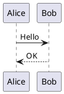
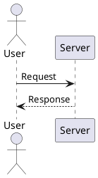

# Markdown Preview Enhanced のスタイル雛形

VS Code 拡張 [Markdown Preview Enhanced](https://marketplace.visualstudio.com/items?itemName=shd101wyy.markdown-preview-enhanced)(MPE)の
プレビュー用スタイル(CSS/LESS)の雛形。各マシンへ手動コピーして使う
(`$HOME` への自動リンクはしない。テンプレート配布方式)。macOS / Windows / Linux 共通。

## ファイル一覧

`global/` 以下がグローバル設定(全プロジェクト共通)一式。同じ内容をプロジェクトの
`.crossnote/` へコピーすればワークスペース単位の設定になる。

| ファイル | 説明 |
|----------|------|
| `global/.crossnote/style.less` | 参照用テンプレート(何も上書きしない空のベース) |
| `global/.crossnote/style.chapter.less` | 章番号付き見出し |
| `global/.crossnote/style.clean.less` | クリーン・読みやすさ重視 |
| `global/.crossnote/style.dark.less` | ダーク・コントラスト重視 |
| `global/.crossnote/style.neon.less` | ネオン・アクセント重視 |
| `global/.crossnote/style.system.less` | システム設計書向け |
| `global/sample.md` | スタイル確認用のサンプル資料(ダミー内容) |

**スタイルのみを置く方針**。MPE は同じ `.crossnote/` に `config.js`(数式・図の描画エンジン設定)や
`parser.js`(Markdown の変換フック)も置けるが、これらは MPE がプレビュー時に評価する
**実行スクリプト**であり、かつ MPE の内部仕様に追従して古びる。雛形として抱える価値が薄いため
置かない(必要になったマシンで、下記コマンドから開いて直接書く)。

## 配置場所

| 範囲 | 配置場所 |
|------|----------|
| グローバル | Windows: `%USERPROFILE%\.crossnote\` / Unix 系: `$XDG_CONFIG_HOME/.crossnote/` または `$HOME/.local/state/crossnote/` |
| ワークスペース | `<プロジェクト>/.crossnote/` |

グローバル側は環境で場所が変わるため、**VS Code のコマンドパレットから開くのが確実**。

- `Markdown Preview Enhanced: Customize CSS (Global)` / `(Workspace)` → `style.less` が開く

開いたファイルへ、この雛形から選んだスタイルの中身を貼る。

## 使い方(ワークスペース設定の場合)

```bash
mkdir -p .crossnote
cp templates/markdown-preview-enhanced/global/.crossnote/style.chapter.less .crossnote/style.less
# style.clean.less / style.dark.less / style.neon.less / style.system.less も同様
# 何も上書きしないベースから書き始める場合は style.less をコピーする
```

`global/sample.md` をプレビューすると、選んだスタイルの見え方をひと通り確認できる。

スタイルは `.markdown-preview.markdown-preview` クラス配下に適用される。
プレビューのテーマなど見た目以外の切替は VS Code の設定
(`markdown-preview-enhanced.*`。設定 UI で「Markdown Preview Enhanced」を検索)で行う。

## セキュリティ上の注意

雛形の CSS 自体は外部参照(`@import` / `url(...)` による外部読み込み)を含まないが、
MPE には**有効にすると危険な設定が2つある**。どちらも VS Code の設定側。

- **`markdown-preview-enhanced.enableScriptExecution`** — Markdown 内のコードチャンクを
  実行できるようにする設定。有効にすると、**受け取った `.md` を開くだけで任意コードが実行され得る**。
  MPE の既定も無効。信頼できないファイルを開く可能性がある限り有効にしない。
- **PlantUML のサーバー方式** — 図のソースが外部サーバー(`plantuml.com` / `kroki.io` 等)へ
  **送信される**。業務内容や機密を含む図には使わず、ローカル JAR 方式にする(オフラインでも動く)。

## PlantUML

Markdown 内で PlantUML を使う場合は、以下のようにブロックを書く。



描画方式はローカル JAR とサーバーのどちらかを VS Code の設定で選ぶ(前述の注意を参照)。

### plantuml.jar の配置場所

配置場所に決まりはない。設定でパスを指定すればどこでも動く。

| 配置場所 | 使う人 |
|----------|--------|
| `~/tools/` や `~/bin/` | シンプル派 |
| `~/Library/Java/` (Mac) | Java関連をまとめたい人 |
| `~/.local/lib/` (Linux) | XDG準拠派 |
| `C:\tools\` (Win) | パスが短くて楽 |
| プロジェクト内 | プロジェクト固有で管理したい人 |

以下は配置例。

| OS | 配置例 |
|----|--------|
| macOS | `~/Library/Java/plantuml.jar` |
| Windows | `C:\tools\plantuml.jar` |
| Linux | `~/.local/lib/plantuml.jar` |

> **注意**: パスにスペースを含めないことを推奨。
>
> **ダウンロード**: [PlantUML Releases](https://github.com/plantuml/plantuml/releases) から `plantuml-x.x.x.jar` を取得

### macOS

1. OpenJDK をインストール(Homebrew か PKG)

```bash
brew install --cask microsoft-openjdk
```

2. `plantuml.jar` を配置

```bash
mkdir -p ~/Library/Java
mv ~/Downloads/plantuml-*.jar ~/Library/Java/plantuml.jar
```

3. VS Code の `settings.json` にパスを設定

```json
{
  "markdown-preview-enhanced.plantumlJarPath": "~/Library/Java/plantuml.jar"
}
```

### Windows

1. OpenJDK をインストール(Microsoft Build of OpenJDK の EXE か ZIP)
   - EXE: インストーラーで導入(PATH は自動設定)
   - ZIP: 展開後に `JAVA_HOME` を設定

2. `plantuml.jar` を配置

```powershell
mkdir C:\tools
move %USERPROFILE%\Downloads\plantuml-*.jar C:\tools\plantuml.jar
```

3. VS Code の `settings.json` にパスを設定

```json
{
  "markdown-preview-enhanced.plantumlJarPath": "C:\\tools\\plantuml.jar"
}
```

### サーバー方式(非推奨)

ローカルに `jar` を置かない方式。手軽だが**図のソースが外部へ送信され**、オフラインでは動かない。

```json
{
  "markdown-preview-enhanced.plantumlServer": "https://kroki.io/plantuml/svg/"
}
```

## Graphviz のインストール(オプション)

シーケンス図以外(クラス図、ER図、コンポーネント図など)を描画するには Graphviz が必要。

### macOS

```bash
brew install graphviz
```

### Windows

```powershell
# winget を使う場合
winget install Graphviz.Graphviz

# または Chocolatey
choco install graphviz
```

インストール後、`dot -V` でバージョンが表示されれば OK。

### Linux

```bash
# Debian/Ubuntu
sudo apt install graphviz

# RHEL/Fedora
sudo dnf install graphviz
```

## 動作確認

以下のコードブロックをプレビューして図が表示されれば成功。


