# サンプル資料集

このファイルは Markdown Preview Enhanced のスタイル確認用サンプルです。
複数の資料タイプを想定した構成になっています。

---

# 1. 社内報告・議事録

## 目的

- 進捗を短く共有する
- 決定事項と次アクションを明確化

## 会議概要

| 項目 | 内容 |
|---|---|
| 日時 | 2026-02-06 10:00-10:45 |
| 参加者 | A / B / C |
| 場所 | オンライン |

## 決定事項

- 新UIのA/Bテストを来週開始
- 旧APIの廃止通知は3/1に送付

## TODO

- [ ] 仕様書の更新
- [x] 広報文面のドラフト作成
- [ ] 影響範囲の確認

> 注意: 次回は数値目標とKPIを必ず添えること。

---

# 2. 企画書・提案書

## 背景

市場の需要が高い一方、オンボーディングの離脱率が高い。

## 提案

1. 初回体験の簡略化
2. チュートリアルの段階分割
3. ヘルプセンターの導線改善

### 期待効果

- コンバージョン +12%
- サポート工数 -20%

### 図（Mermaid）

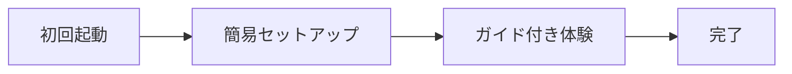

---

# 3. 技術ドキュメント

## API サンプル

```bash
curl -X POST https://api.example.com/v1/items \
  -H "Authorization: Bearer $TOKEN" \
  -H "Content-Type: application/json" \
  -d '{"name":"sample","price":1200}'
```

```json
{
  "id": "itm_123",
  "name": "sample",
  "price": 1200,
  "status": "active"
}
```

## 擬似コード

```python
def calc_score(items):
    total = 0
    for item in items:
        total += item.value * 1.2
    return total
```

---

# 4. 仕様書

## 用語

- **ユーザー**: サービスを利用する個人
- **管理者**: ユーザーを管理する権限を持つ担当者

## 要件

- 1分以内に初期設定が完了すること
- モバイル画面幅 360px で表示崩れがないこと

## 画面遷移

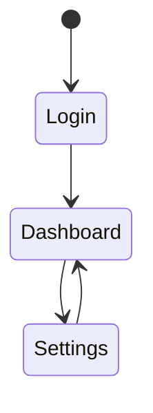

---

# 5. 研究ノート・メモ

## アイデア

- 仮説: UIの情報密度を下げると離脱が減る
- 反証: 情報が足りず逆に混乱する可能性

## 参考リンク

- <https://example.com>

---

# 6. チェックリスト

- [x] 目的の明確化
- [x] ペルソナの想定
- [ ] ページ構成のレビュー
- [ ] コピーの最終確認

---

# 7. データ・表

| 指標 | 現状 | 目標 |
|---|---:|---:|
| CVR | 2.1% | 2.8% |
| 継続率 | 43% | 55% |
| NPS | 14 | 25 |

---

# 8. 画像


---

# 9. 強調表現

**太字** / *斜体* / ~~取り消し~~ / `インラインコード`

---

# 10. 図表集（Mermaid & PlantUML）

## フローチャート（Mermaid）

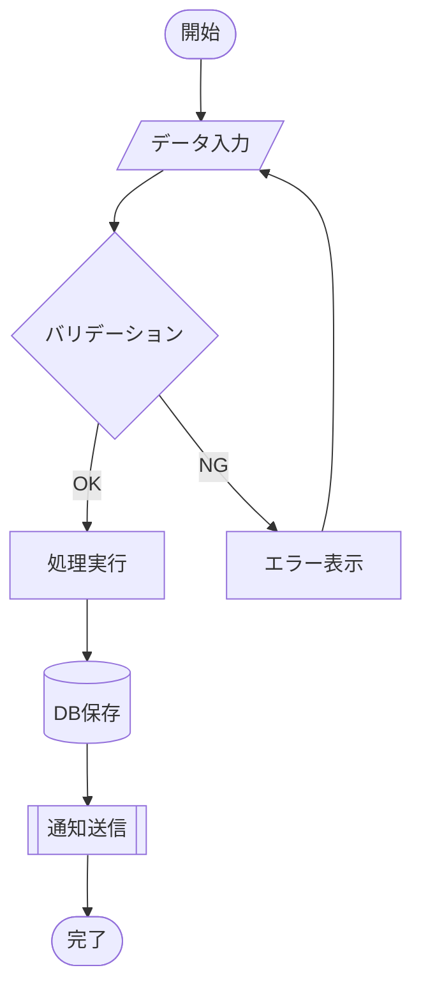

## シーケンス図（Mermaid）

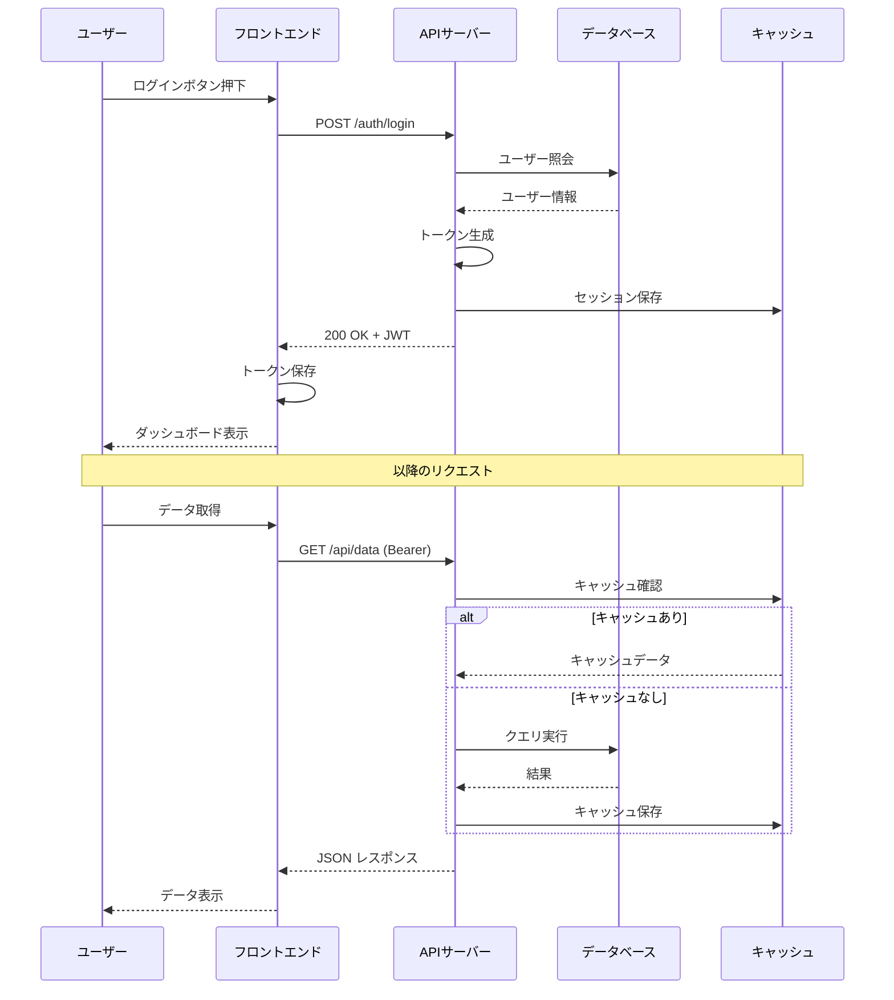

## クラス図（Mermaid）

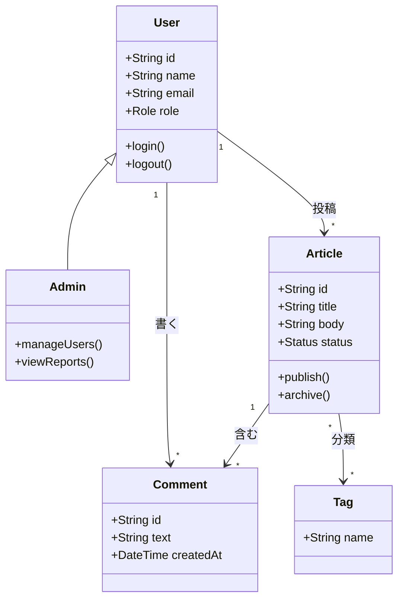

## ER図（Mermaid）

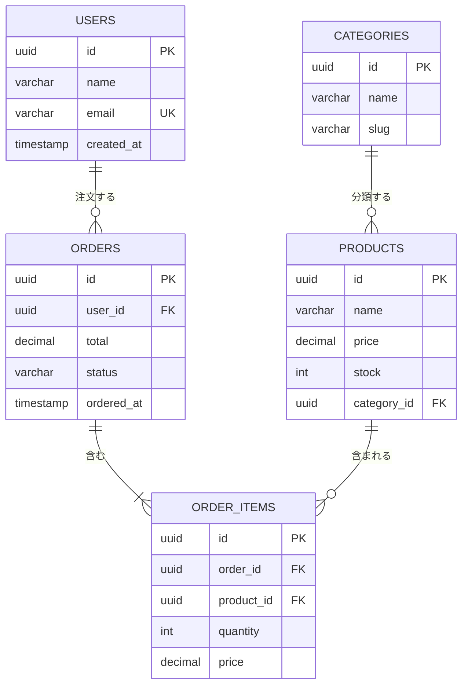

## ガントチャート（Mermaid）

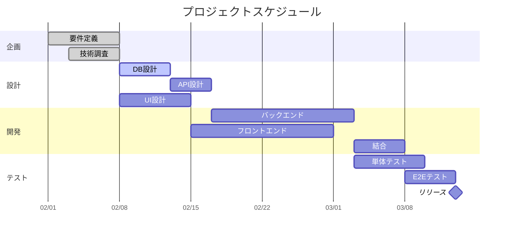

## 円グラフ（Mermaid）

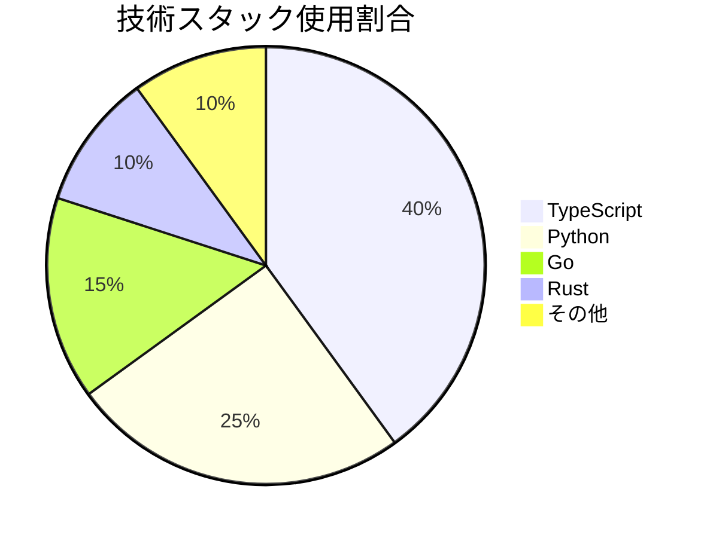

## Git グラフ（Mermaid）

```mermaid
gitgraph
  commit id: "initial"
  commit id: "setup"
  branch feature/auth
  checkout feature/auth
  commit id: "add login"
  commit id: "add JWT"
  checkout main
  branch feature/ui
  checkout feature/ui
  commit id: "header"
  commit id: "sidebar"
  checkout main
  merge feature/auth id: "merge auth"
  checkout feature/ui
  commit id: "responsive"
  checkout main
  merge feature/ui id: "merge ui"
  commit id: "v1.0" tag: "release"
```

## タイムライン（Mermaid）

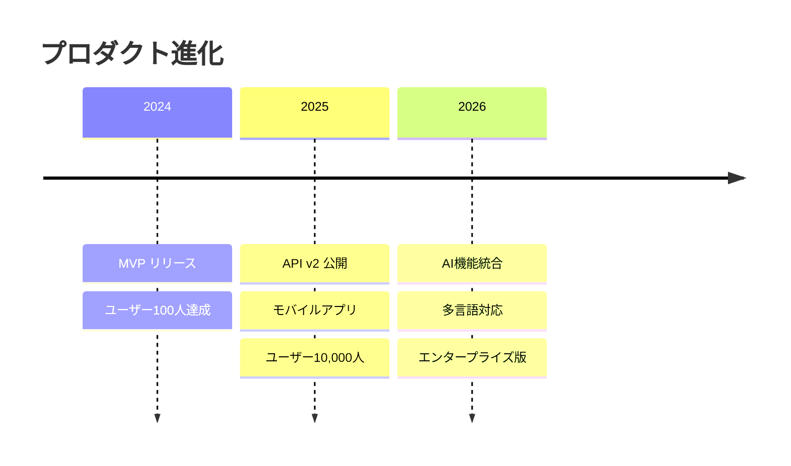

## マインドマップ（Mermaid）

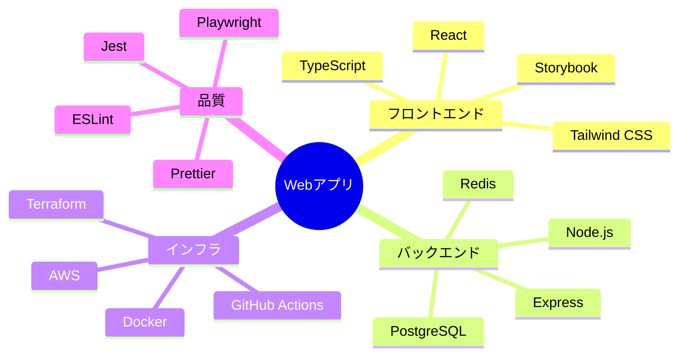

---

## シーケンス図（PlantUML）

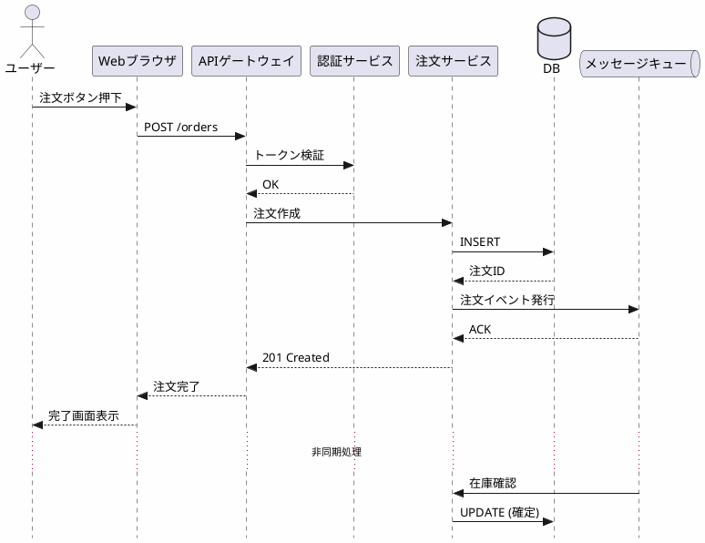

## クラス図（PlantUML）

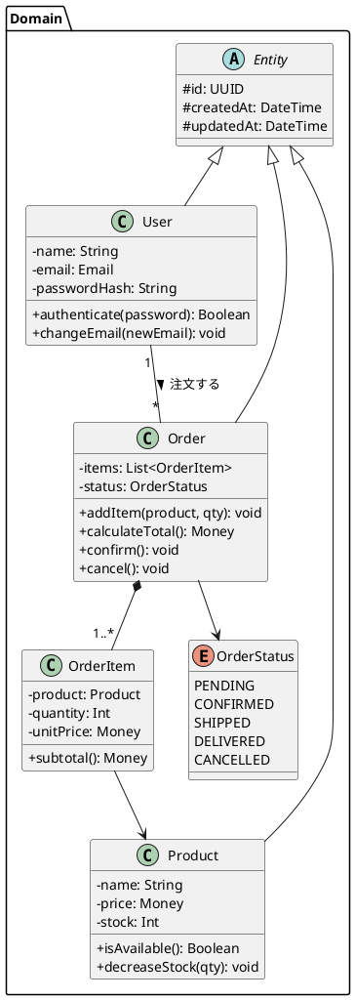

## アクティビティ図（PlantUML）

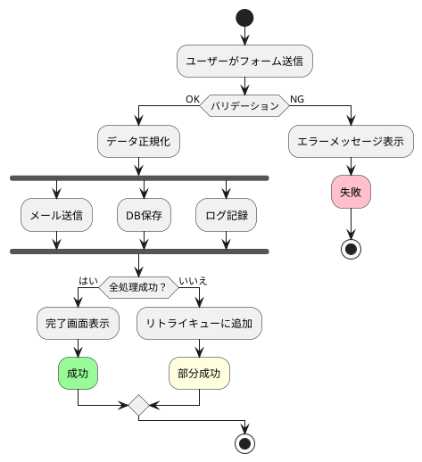

## コンポーネント図（PlantUML）

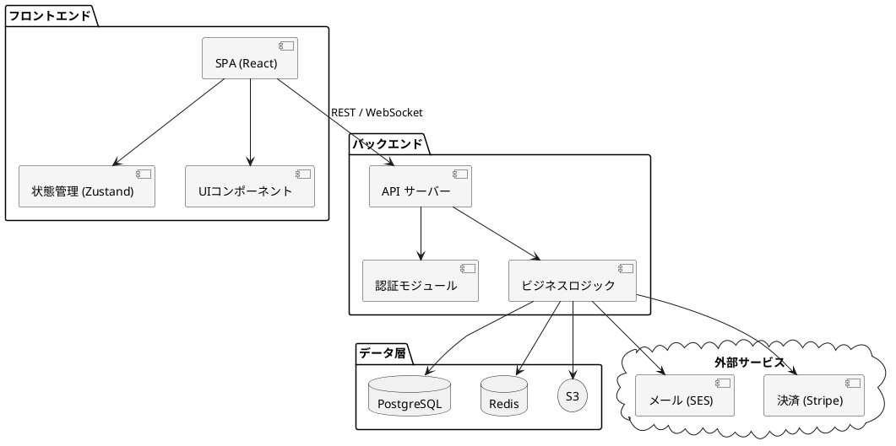

## 状態遷移図（PlantUML）

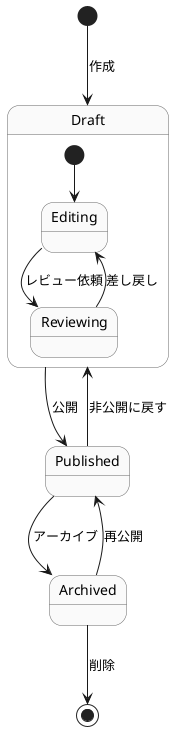

---

# 11. 強調表現

**太字** / *斜体* / ~~取り消し~~ / `インラインコード`

---

# 12. 水平線

---

以上。
